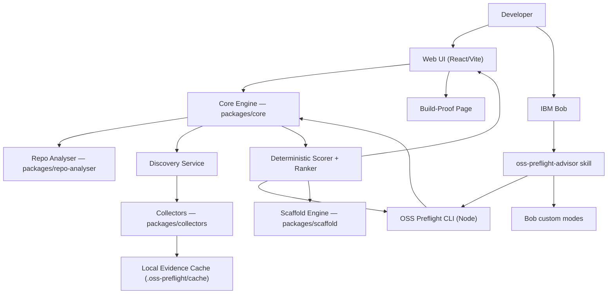

# OSS Preflight — Architecture (Source of Truth)

> **This is the single source of truth for what OSS Preflight is and how it is designed.**
> Build sequencing lives in [implementation-plan.md](./implementation-plan.md).
> How we use IBM Bob to build it lives in [bob-build-guide.md](./bob-build-guide.md).

| | |
|---|---|
| **Event** | IBM Bob Hackathon (lablab.ai) |
| **Window** | 15 May 2026 17:00 SAST → 17 May 2026 17:00 SAST (48h) |
| **Builder** | Solo, with IBM Bob as the SDLC partner |
| **License** | MIT (hackathon requirement) |
| **Version** | 2.0 — consolidated |

---

## 1. One sentence

**You have an idea. OSS Preflight (Open Source Software Preflight) uses IBM Bob and live open-source evidence to hand you the right stack — recommendations, tradeoffs, and a working starter — before you lose the energy to build it.**

Closing line for the pitch:

> We built OSS Preflight in 48 hours with Bob. And we shipped OSS Preflight *as* a Bob skill, so you can run the same workflow inside your own repo.

---

## 2. Problem

AI made code generation cheap. It did **not** make dependency and architecture decisions cheap. Developers lose momentum in the gap between *"I have an idea"*, *"I know what to build with"*, and *"I have a working starter"*.

The pain has three parts:

- **Option overload** — npm, PyPI, GitHub, Hugging Face, and OSS starters create more choices than anyone can vet by hand.
- **Fork-first blind spot** — many ideas are already partly built in open source, but finding the right starter is its own research task.
- **Trust gap** — before adding a dependency you need evidence on maintenance, license, compatibility, and safety.

OSS Preflight closes that gap **at the moment of decision**.

---

## 3. Product — three flows

### 3.1 Idea Flow (primary demo)

Developer enters a rough idea:

> I want to build a Discord bot that summarises the last 24 hours of channel activity.

OSS Preflight converts the idea into a structured intent, discovers candidates across OSS sources, gathers evidence, ranks options, and returns **three recommendations**. The developer picks one; OSS Preflight scaffolds a working starter with a README, smoke test, and adoption report.

### 3.2 Repo Flow

Developer points OSS Preflight at a GitHub URL or local repo. OSS Preflight detects the stack, runs Evidence Passports over dependencies, flags risks, and surfaces safer or better-fit alternatives.

### 3.3 Bob-Native Flow

Developer opens IBM Bob and asks *"Run OSS Preflight on this idea."* The `oss-preflight-advisor` skill activates, reads repo context, invokes the OSS Preflight CLI, presents recommendations, and uses sandboxed custom modes for approved provider setup and scaffold writes. This is the agentic workflow layer; package verification remains deterministic through collectors, cache, scoring rules, and smoke tests.

---

## 4. What OSS Preflight is **not**

Not a guarantee. Not a replacement for engineering judgment. Not a cryptographic proof system. Not a public ledger. Not a trust graph. Not an LLM-only recommender.

OSS Preflight gives **evidence-backed confidence, not certainty.**

---

## 5. The core innovation: the fact/inference split

Every recommendation carries an **Evidence Passport** with two visibly separated columns:

| Facts (sourced) | Interpretation (AI-derived) |
|---|---|
| source URL | goal-fit summary |
| registry metadata | compatibility narrative |
| license | tradeoffs |
| latest version | warnings |
| last commit | scaffold availability |
| downloads / stars | |
| OpenSSF score (where available) | |
| fetch timestamp | |

A judge sees at a glance what is a measured fact and what is OSS Preflight's assessment. This split is enforced in the data model, the scoring engine, and the UI — not just by convention.

---

## 6. System architecture



**System context (external):** the only outbound calls are to public registries - npm registry, GitHub REST API, PyPI JSON API, OpenSSF Scorecard - plus the configured BYOK AI provider for intent parsing and tradeoff narration (`anthropic`, `openai-compatible`, or `gemini`). With no provider configured, OSS Preflight uses local keyword parsing. No package is installed or executed; only metadata is fetched.

---

## 7. Repository structure

```text
oss-preflight/
  apps/web/                     # React/Vite UI + Express bridge
  packages/
    core/                       # decision engine, pure logic, no I/O
    collectors/                 # live API calls — single source of facts
    repo-analyser/              # detect stack from an existing repo
    scaffold/                   # template engine + smoke runner
    cli/                        # terminal interface (Bob + CI target)
  examples/discord-summary-bot/ # known-good generated scaffold (demo fallback)
  .bob/                         # Bob configuration (committed, see bob-build-guide.md)
    custom_modes.yaml           # overrides plan/code/orchestrator + reviewer/scaffolder
    rules/                      # always-on discipline (all modes, every conversation)
    rules-plan/  rules-code/  rules-reviewer/  rules-orchestrator/
    skills/{oss-preflight-advisor,evidence-discipline,code-review,test-runner,doc-writer,plan-council}/SKILL.md
  bob_sessions/                 # official Bob deliverable folder (single location)
    build-report.md             # living submission ledger (single summary)
    S00-hour0-export-test/      # per-session: task-history.md + consumption-summary.png
  docs/
    architecture.md             # THIS FILE — source of truth
    implementation-plan.md      # build sequence, pro tips, risks, demo, submission
    bob-build-guide.md          # how we use IBM Bob (verified)
    bob-prompts.md              # supercharged Bob prompts + uncommon pro tips
```

---

## 8. Core engine — five stages

The engine in `packages/core/` is **pure logic, no I/O**. It runs five stages:

1. **Intent extraction** - convert the raw idea string into an `IdeaBrief`. Uses a provider-neutral intent parser (`anthropic`, `openai-compatible`, `gemini`, or local `keyword`) with temperature `0` for network providers. Every inferred field is tagged `@source: 'inferred'`.
2. **Candidate discovery** — find packages, frameworks, SDKs, components, and starter repos.
3. **Evidence gathering** — fetch registry, GitHub, OpenSSF, and optional model metadata via collectors.
4. **Ranking** — score candidates against intent and constraints using a deterministic function.
5. **Recommendation output** — produce ranked options and write `.oss-preflight/recommendations/latest.json`.

---

## 9. Data model

Defined in `packages/core/src/types.ts` with JSDoc `@source` tags (`fact` | `inferred`). Validated with `zod`.

- **`IdeaBrief`** — parsed user intent: `capabilities` (inferred), `domain` (inferred), `targetUser` (inferred), `ecosystem` (inferred), `constraints` (user-provided).
- **`Candidate`** — a package found in a registry: `name`, `version`, `ecosystem` (`npm` | `pypi` | `github`), `homepageUrl`, `repositoryUrl`.
- **`EvidencePassport`** — `facts` (all sourced, see §5) + `interpretation` (AI-derived).
- **`Recommendation`** — final ranked output: `rank`, `score`, `candidate`, `subscores` (6 dimensions), `passport`, `scaffoldAvailable`, `templateId`.

Serialization rules: missing passport fields are emitted as explicit `null`, never omitted. The serializer rejects incomplete evidence rather than hiding it.

---

## 10. Scoring model

Six dimensions, transparent weights, every subscore independently computable and 0–100. Weights are visible in the UI and user-overridable.

| Dimension | Weight | Source |
|---|---:|---|
| Goal fit | 30% | inference |
| Repo compatibility | 25% | fact (stack detector) |
| Maintenance health | 15% | fact (GitHub commits/releases) |
| Safety signals | 15% | fact (OpenSSF + license check) |
| Community signal | 10% | fact (downloads + stars) |
| Docs & starter quality | 5% | mixed |

The **"underrated pick"** is a *badge, not a hidden weight*. It applies when a candidate has strong fit but lower social signal.

**Hard rule:** no fact is asserted without a collector source. If evidence for a dimension is missing, the candidate is still scored, the subscore is marked *incomplete*, and the UI shows the gap.

---

## 11. Collectors and cache strategy

Collectors in `packages/collectors/` are the **single source of truth for facts**. Every external response is cached in `.oss-preflight/cache/{ecosystem}/{id}.json` with `data`, `collectedAt` (ISO-8601), and `source: 'live' | 'cache'`.

| Collector | Endpoint | Cache TTL | Notes |
|---|---|---:|---|
| npm | `registry.npmjs.org/{name}/latest` | 6h | 404 → `PackageNotFoundError`, never fake data |
| GitHub | REST `/repos/{owner}/{repo}` (+ contributors) | 2h | rate-limited → cached + `source: 'cache-fallback'` |
| PyPI | `pypi.org/pypi/{name}/json` | 6h | should-ship |
| OpenSSF | Scorecard API | 24h | missing → `null`, not a failure |

The UI labels every fact as **live** or **cached** (and `(rate-limited)` / `(not available)` where relevant). `--refresh` (CLI) and a per-card Refresh button force live calls.

---

## 12. Hallucination controls

- LLMs **may** infer intent and explain tradeoffs.
- LLMs **may not** assert package facts.
- Candidate names must resolve in a registry or on GitHub.
- Missing evidence must be shown explicitly ("no data" / "not available", never silence).
- Smoke tests must report pass/fail truthfully.
- Banned words in any user-facing copy: "guaranteed", "perfect", "proves best".

These are enforced by the `evidence-discipline` Bob skill during the build (see [bob-build-guide.md](./bob-build-guide.md)).

---

## 13. API contracts

### 13.1 CLI — `oss-preflight recommend --idea "..." --json`

```json
{
  "recommendations": [
    {
      "rank": 1,
      "score": 87.5,
      "candidate": {
        "name": "discord.js",
        "version": "14.11.0",
        "ecosystem": "npm",
        "homepageUrl": "https://discord.js.org",
        "repositoryUrl": "https://github.com/discordjs/discord.js"
      },
      "subscores": {
        "goalFit": 95, "repoCompat": 85, "maintenance": 85,
        "safety": 80, "community": 95, "docsQuality": 80
      },
      "passport": {
        "facts": {
          "license":         { "value": "Apache-2.0", "source": "https://...", "collectedAt": "2026-05-15T10:30:00Z", "sourceType": "npm" },
          "weeklyDownloads": { "value": 1200000,      "source": "https://...", "collectedAt": "2026-05-15T10:30:00Z", "sourceType": "npm" },
          "lastCommit":      { "value": "2026-05-14T15:22:00Z", "source": "https://...", "sourceType": "github" },
          "stars":           { "value": 27500,        "source": "https://...", "sourceType": "github" }
        },
        "interpretation": {
          "goalFit": "Excellent match for Discord bot development; de-facto standard.",
          "compatibility": "Works in TypeScript or JavaScript. Strong ES2020+ support.",
          "tradeoffs": [
            "Largest download footprint of the three; consider discord.py for a lighter bundle.",
            "TypeScript-first; plain JS needs transpilation for production."
          ],
          "warnings": [],
          "recommendedAlongside": ["typescript", "dotenv"]
        }
      },
      "scaffoldAvailable": true,
      "templateId": "discord-summary-bot"
    }
  ],
  "ideas_parsed": {
    "capabilities": ["message processing", "scheduled summarization"],
    "domain": "discord community management",
    "targetUser": "solo developer",
    "ecosystem": "javascript/typescript"
  }
}
```

**Contract guarantees:** every `facts` field has `source` (URL or `"inferred"`), `collectedAt` (ISO-8601), and `sourceType` (`npm|github|openssf|inferred`). Every subscore is 0–100. `tradeoffs` is a string array. `warnings` is populated only when something is concerning.

`oss-preflight scaffold --recommendation <json> --out <dir>` loads a recommendation, generates the starter, runs the smoke test, prints the adoption report, and exits `0` (pass) or `1` (smoke fail).

### 13.2 Web API (Express bridge in `apps/web/server.ts`)

- `POST /api/recommend` → spawns `oss-preflight recommend --json`, parses stdout, returns `{ recommendations, error? }`.
- `POST /api/scaffold` → runs the scaffold engine, returns `{ files, passed, output }`.

The web server is a thin bridge — all logic lives in the CLI/core so the Bob skill and CI hit the same path.

---

## 14. Error handling

| Situation | Behaviour | UI label |
|---|---|---|
| Live API fails, cache exists | return cached | `(cached, rate-limited)` |
| Package not found | throw, skip candidate (never fake) | candidate omitted |
| Missing signal (e.g. no OpenSSF) | `null` in that field | `(not available)` |
| Scorer has incomplete data | score anyway, mark dimension incomplete | gap shown on score bar |
| Smoke test fails | adoption report states failure; exit 1 | red smoke status |

**CLI exit codes:** `0` success - `1` collector/API error - `2` user-input error - `3` config error (explicit AI provider is invalid or missing required key/model).

---

## 15. Security and privacy

- No user data logged or persisted beyond the session.
- API keys (`ANTHROPIC_API_KEY`, `OPENAI_API_KEY`, `GEMINI_API_KEY`, `GITHUB_TOKEN`) are read from env, never logged, and never stored in `.oss-preflight/config.json`.
- Cache files are local-only, never uploaded.
- Collector sources are public registries; no package is installed or executed — metadata only.
- Scaffold templates are read-only; generated output is plaintext.

---

## 16. Deployment model

| Path | Command |
|---|---|
| Standalone CLI | `npm i -g oss-preflight` → `oss-preflight recommend --idea "..."` |
| Web UI | `npm install && npm run build && npm run start:web` → `http://localhost:3000` |
| Bob IDE (runtime) | Open Bob → "Run OSS Preflight on this idea" → `oss-preflight-advisor` skill activates |
| CI/CD (future) | GitHub Action runs `oss-preflight scaffold --validate-deps` on PR |

> **Toolchain note (intentional, not a contradiction):** the **monorepo
> itself is built and tested with pnpm** (`pnpm-workspace.yaml`, `pnpm test`
> in the phase exit gates). The **generated end-user scaffolds use plain
> `npm`** (`npm install`, `npm test` in the smoke runner) so a developer
> adopting a starter inherits no workspace assumptions. Both are correct for
> their layer — never "normalize" one to the other.

---

## 17. Wow moments & judge success criteria

**Wow moments:** (1) idea → three ranked options with Evidence Passports; (2) one click → working scaffold + green smoke test; (3) Bob build receipts — exported sessions, custom modes, skills, rules, build report, Bob-assisted commits.

**Judges should be able to verify:**

1. The recommendation feels right — discord.js surfaces as top pick, reasoning is transparent.
2. No hallucination — every fact is sourced; every inference is labeled.
3. The demo works live — no hidden pre-recording except the documented fallback.
4. Bob is visible — sessions exported, build report in repo, modes/skills/rules committed.
5. The UI is clear — fact/inference split obvious at a glance.
6. The scaffold works — generated code runs the smoke test green.

---

## 18. Scope cutline

**Must ship:** idea→recommendation JSON · Evidence Passport with fact/inference split · ranked top-3 · npm + GitHub collectors · cache with timestamps · Discord-bot scaffold · smoke test · web UI for the demo · `/build-proof` · Bob custom modes/skills/rules · `bob_sessions/` exports + build report · demo script.

**Should ship:** PyPI collector · OpenSSF collector · repo flow · fork-first GitHub starter search · live Bob skill demo · Bob-generated PR description.

**Does not ship:** Hugging Face collector · MCP server · Bobalytics integration · multiple scaffold templates · live judge-repo audit · vouchers · signing · ledger · trust graph · marketplace · auth · billing.

Decision gates (full timeline in [implementation-plan.md](./implementation-plan.md)): **Hour 14** CLI must work or drop UI · **Hour 24** UI must work or drop repo flow · **Hour 38** three clean demo runs or record backup.

---

## 19. Final principle

> Bob is not a logo in the pitch. Bob is the visible SDLC partner that made this project possible in 48 hours, and the workflow-packaging layer that makes it useful to every developer who installs it.
