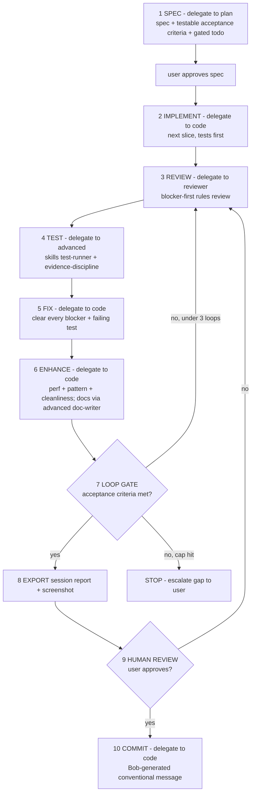

# OSS Preflight — IBM Bob Build Guide

> **How we use IBM Bob to build OSS Preflight, and how we prove it.**
> Every capability below is verified against official IBM Bob documentation (sources in §2 and inline).
> The exact, supercharged prompts for each session live in [bob-prompts.md](./bob-prompts.md).
> What we build is in [architecture.md](./architecture.md); the build order is in [implementation-plan.md](./implementation-plan.md).

---

## 1. What IBM Bob is

IBM Bob is IBM's agentic AI IDE. It runs specialized **modes**, reusable **skills**, project **rules**, automatic **checkpoints**, and Git assistance (commit messages, PR descriptions). OSS Preflight uses Bob two ways: **Bob builds OSS Preflight**, and **OSS Preflight ships as a Bob skill** so any developer can run the workflow inside their own repo.

> Bob is not a logo in the pitch. Bob is the visible SDLC partner that made this project possible in 48 hours.

---

## 2. Verified capability matrix

Every row was confirmed against official IBM Bob docs in May 2026. Use this table — not assumptions — when wiring `.bob/`.

| Capability | Verified behaviour | How OSS Preflight uses it | Official source |
|---|---|---|---|
| **Built-in modes (verified tools)** | Plan (`read`, `edit`*markdown*, `mcp`), Code (`read`, `edit`, `command`), Advanced (`read`, `edit`, `command`, `mcp`, **skills**), Ask (`read`, `mcp`), Orchestrator (delegation via `new_task`/`switch_mode`). Switch via dropdown, slash command, or ⌘+. / Ctrl+. | We override Plan/Code/Orchestrator; leave Advanced/Ask stock | https://bob.ibm.com/docs/ide/features/modes |
| **Override default modes** | Create a custom mode reusing a default **slug** (`plan`, `code`, `orchestrator`) to replace it. Project override > global override > default | The disciplined roles apply on every `/plan`, `/code`, and Orchestrator `new_task` — no reliance on a human picking a mode | https://bob.ibm.com/docs/ide/configuration/custom-modes |
| **Custom modes** | `.bob/custom_modes.yaml`; fields `slug,name,roleDefinition,whenToUse,customInstructions,groups` | 3 overrides (plan, code, orchestrator) + 2 additive (reviewer, oss-preflight-scaffolder) | https://bob.ibm.com/docs/ide/configuration/custom-modes |
| **Permission groups** | `read, edit, browser, command, mcp, skill` | Each mode gets only the groups it needs | https://bob.ibm.com/docs/ide/configuration/custom-modes |
| **`fileRegex` restriction** | Regex on the `edit` group limits writable files (**single backslash, unquoted** in YAML, per official example `\.py$`) | plan → specs/docs md; code → app/tests; reviewer → docs md; scaffolder → output dirs | https://bob.ibm.com/docs/ide/configuration/custom-modes |
| **Mode-specific rules** | `.bob/rules-{slug}/` directory (files loaded alphabetically, **preferred**) or `.bobrules-{slug}` single file; directory wins if both exist | `.bob/rules-plan/`, `.bob/rules-code/`, `.bob/rules-reviewer/`, `.bob/rules-orchestrator/` (loop invariants — defense-in-depth) | https://bob.ibm.com/docs/ide/configuration/custom-modes |
| **Project rules (always-on)** | `.bob/rules/` markdown, auto-injected into **every conversation across all modes**, version-controlled, code-reviewed | The reliability backbone: evidence discipline, engineering standards, scope/gates, claims — applies even where skills do not | https://bob.ibm.com/docs/ide/getting-started/tutorials/standardize-bobs-behavior |
| **Skills** | `SKILL.md` with `name` + `description` frontmatter; `description` drives activation; `.bob/skills/` (project) overrides `~/.bob/skills/` (global); loads once per conversation; approval required before activation by default | 6 skills: `oss-preflight-advisor` (runtime), `evidence-discipline` (fact-check), `code-review`, `test-runner`, `doc-writer` (loop recipes), `plan-council` (pre-build gate) | https://bob.ibm.com/docs/ide/features/skills |
| **Where skills run** | Skills are guaranteed in **Advanced mode** per the Skills docs. Custom Modes docs also list `skill` as an available tool group, so a custom mode may declare it when the installed Bob build supports that schema | Advanced remains the guaranteed skill runtime; `reviewer` also declares the official `skill` group for review recipes. If a local Bob build rejects `skill`, route those recipe steps to Advanced and keep the rules floor intact | https://bob.ibm.com/docs/ide/features/skills · https://bob.ibm.com/docs/ide/configuration/custom-modes |
| **Checkpoints** | Auto-created at task start and **before file modifications** (not before commands); "Restore Files" / "Restore Files & Task"; shadow Git repo; respects `.gitignore`; nested Git repos disable it; Git must be installed | Safety net during every build session; recovery path on bad output | https://bob.ibm.com/docs/ide/features/checkpoints |
| **Commit messages** | Sparkle icon by the commit field; analyses staged changes + branch name + recent history; conventional-commit style; click again to regenerate | Bob-generated commit messages document each increment | https://bob.ibm.com/docs/ide/features/commit-messages |
| **Pull requests** | Generates PR descriptions from IDE changes | Bob-generated PR text (should-ship evidence) | https://bob.ibm.com/docs/ide/features/pull-requests |
| **MCP** | Model Context Protocol extends Bob with custom tools/APIs | Not on critical path; available in Advanced if needed | https://bob.ibm.com/docs/ide/changelog |
| **Bob Shell** | Optional terminal integration | Checked in Hour 0; not required | https://bob.ibm.com/docs/shell |
| **Hackathon requirement** | Public GitHub repo, MIT, working online prototype, video + pitch deck, **exported Bob task-session reports of all relevant tasks**, must show meaningful Bob IDE use as a core component | Drives the entire evidence strategy in §6 | https://lablab.ai/ai-hackathons/ibm-bob-hackathon · [local guide](./Lablab-IBM-Bob-hackathon-guide-May-2026.pdf) pp. 4, 18–19 |
| **Official task-session export shape** | In Bob IDE: Views and More Actions → History → select task → select task header → screenshot task-session consumption summary → Export task history as markdown. Upload all relevant screenshots + exported task-history markdown files into `bob_sessions/` in the final repo | `bob_sessions/` is the single export folder; `bob_sessions/build-report.md` is the single summary ledger | [local guide](./Lablab-IBM-Bob-hackathon-guide-May-2026.pdf) pp. 18–19 |

**Corrections this verification produced (do not repeat the old assumptions):**

- **Skills are guaranteed in Advanced; `reviewer` also declares the official `skill` group.** Discipline that must *always* hold lives in always-on `.bob/rules/`, not only in a skill. Skills are the richer *recipe*; rules are the *floor*. If an installed Bob schema lags the official custom-mode docs and rejects `skill`, run the recipe step in Advanced rather than deleting the skill workflows.
- **Plan mode edits markdown only** and has no `command`/`browser`. Ideal — the overridden `plan` produces specs safely, then hands to `code`.
- **Code mode has no MCP/Browser/Skills** — only `read`, `edit`, `command`. The overridden `code` relies on always-on rules (which inject everywhere) for discipline.
- **Checkpoints do not snapshot before commands**, only at task start and before file edits. Never rely on a checkpoint to undo a destructive shell command.
- **There is no documented `bob export` CLI.** Session export is via the Bob UI/report workflow. Any CLI export (from community discussion) stays **unverified** until proven in Hour 0.
- **Override > additive.** New custom slugs need a human to pick them; overriding `plan`/`code`/`orchestrator` makes the discipline unavoidable because slash commands and Orchestrator delegation always land on those slugs.

---

## 3. The two ways OSS Preflight uses Bob

### Way 1 — Bob builds OSS Preflight

Bob is the SDLC partner across the whole 48 hours: spec/planning (overridden **Plan**), feature-loop coordination (overridden **Orchestrator**), all implementation/test/fix/enhance (overridden **Code**), submission QA (**reviewer**), runtime skill (**Advanced**). Every meaningful session leaves an exported report, a row in `bob_sessions/build-report.md`, and a committed artifact.

### Way 2 — OSS Preflight runs inside Bob

`oss-preflight-advisor` (skill) lets any developer ask Bob *"Run OSS Preflight on this idea"*. `oss-preflight-scaffolder` (custom mode) writes only to approved output paths. Runtime Bob is a **premium path, not a hard dependency** — the hackathon proof is the build trail.

---

## 4. Bob configuration: the mode / skill / rule map

We supercharge the SDLC by **overriding the three default slugs Bob actually
uses** (`plan`, `code`, `orchestrator`) and letting **always-on rules** carry
the discipline. We override **only where necessary** — Advanced and Ask stay
stock (Advanced must keep full power so skills activate; Ask is read-only Q&A).

```text
.bob/
  custom_modes.yaml                 # 3 overrides + 2 additive (see map below)
  rules/                            # ALWAYS-ON, every mode + conversation
    01-evidence-discipline.md       #   no invented facts; label inference
    02-engineering-standards.md     #   clean/modern/maintainable/secure/perf
    03-scope-and-gates.md           #   cutline + decision gates + stop-and-ask
    04-presentation-claims.md       #   allowed vs banned claim language
  rules-plan/01-spec-quality.md     # mode-specific: enforces §4 spec contract
  rules-code/01-build-floor.md      # mode-specific: AC/scope/test-first/commit
  rules-reviewer/01-review-floor.md # mode-specific: per-phase + submission
  rules-orchestrator/01-loop-invariants.md  # defense-in-depth loop invariants
  skills/                           # recipes; guaranteed in Advanced; reviewer declares skill
    oss-preflight-advisor/SKILL.md  #   RUNTIME workflow for end users
    evidence-discipline/SKILL.md    #   fact-check passports/scores
    code-review/SKILL.md            #   REVIEW step recipe
    test-runner/SKILL.md            #   TEST/validate step recipe
    doc-writer/SKILL.md             #   user-facing doc recipe
    plan-council/SKILL.md           #   pre-build adversarial plan gate (≥9/10)
```

**What is used for what — the single source of truth:**

| Slug | Type | Job in the SDLC | Groups + write fence | Rules | Skills here |
|---|---|---|---|---|---|
| `plan` | **override** Plan | Specs, design, gated todo. Markdown only by construction | `read`, `edit`(`docs/ context/ bob/ .bob/` md/txt/yaml), `mcp` | always-on + `rules-plan` | none (not skill-enabled) |
| `code` | **override** Code | Implement / fix / enhance to spec. The slug `/code` + Orchestrator land on | `read`, `edit`(`packages/ apps/ examples/ tests/ .oss-preflight/`), `command` | always-on + `rules-code` | none (not skill-enabled) |
| `orchestrator` | **override** Orchestrator | Runs the feature loop (§5); delegates to plan/code/reviewer/advanced | `read` (delegates via `new_task`) | always-on + `rules-orchestrator` (loop invariants) | none (delegates) |
| `reviewer` | **additive** | Blocker-first QA; REVIEW step of the loop; council team reviews | `read`, `edit`(`docs/ bob/ .bob/` md/txt), `command`, `browser`, `mcp`, `skill` | always-on + `rules-reviewer` | `code-review`, `evidence-discipline`, `plan-council` where supported; Advanced fallback |
| `oss-preflight-scaffolder` | **additive** | Sandboxed runtime scaffolding in a user's repo | `read`, `edit`(`.oss-preflight/ docs/oss-preflight/ examples/ oss-preflight-output/`), `command` | always-on | none |
| `advanced` | **stock** | TEST/validate + doc passes + runtime skill demo (S07) + council teams | all groups + skills | always-on | `test-runner`, `doc-writer`, `evidence-discipline`, `oss-preflight-advisor`, `plan-council` |
| `ask` | **stock** | Read-only Q&A; no SDLC leverage | `read`, `mcp` | always-on | none |

**Rules vs skills vs modes — the rule of thumb:**

- **Rules = the floor (always on).** Injected into every mode and conversation. *Where reliability comes from* — no-hallucination, engineering standards, security, scope. Holds in `code`/`plan` even though they do not declare skills.
- **Skills = the recipe (guaranteed in Advanced; declared on reviewer too).** Reusable workflows for recurring task types — official examples: code reviews, testing, documentation. They enrich a step; they never replace the floor.
- **Modes = who + where.** The unit the Orchestrator delegates to and the file fence. A step that needs a recipe is delegated to a skill-enabled mode; the floor rides along regardless.
- `evidence-discipline` is intentionally **both** a rule *and* a skill: the rule is the invariant on `code`/`plan`; the skill is the richer fact-check procedure in `reviewer` where supported, with Advanced as the guaranteed fallback. Not duplication — floor vs recipe.

> **Why fences + overrides matter for judging:** a governed, file-scoped AI
> workflow that applies *without the human choosing it* is itself evidence of
> responsible, controlled SDLC use — not just generation.

---

## 5. The Orchestrator feature-development loop

**Pre-loop gate — Plan Council (STEP 0).** Before *any* phase loop runs, the
overridden `orchestrator` requires `docs/phase-plan.md` to carry a current
`## Council Verdict = PASS`. If absent/stale/FAIL it runs the `plan-council`
skill: 5 **independent adversarial teams** (reproducibility/idempotency ·
architecture fidelity · AC/test rigor · integration/data-contract continuity ·
gap/risk red team), each delegated as its own `new_task`. Gate =
**MIN team score ≥ 9 AND zero blockers** (adversarial — never averaged). The
council runs **once (cap 1 round)** — it never auto-revises-and-re-councils
(that loop is unbounded in Bobcoin cost). On FAIL: consolidate findings,
record the FAIL verdict, **STOP and escalate to the user** the lowest team +
exact unmet criteria; the user decides whether to delegate a `plan` revision
and re-invoke the council. This is a fixed-cost plan-time gate, enforced by
`.bob/rules-orchestrator/`. Protocol: `.bob/skills/plan-council/SKILL.md`.

Once the council PASSes, the overridden `orchestrator` encodes one
deterministic loop per phase. It delegates each step with `new_task` (full
context, tight scope, "do only this", finish with `attempt_completion`).



**Per-step delegation — mode + skills (what runs where):**

| Step | Delegate to | Skill-enabled? | Skills that fire | Floor (always) |
|---|---|---|---|---|
| 1 SPEC | `plan` | no | — | rules + rules-plan |
| 2 IMPLEMENT | `code` | no | — | rules + rules-code |
| 3 REVIEW | `reviewer` | **yes** | `code-review`, `evidence-discipline` | rules + rules-reviewer |
| 4 TEST / validate | `advanced` | **yes** | `test-runner`, `evidence-discipline` | rules |
| 5 FIX | `code` | no | — | rules + rules-code |
| 6 ENHANCE | `code` (docs → `advanced`) | docs only | `doc-writer` (on the doc pass) | rules + rules-code |
| 10 COMMIT | `code` | no | — | rules |

Build/spec/review sit on custom modes where the **rules floor** is sufficient. Review declares the official `skill` group so review recipes can fire where supported. Test/validate, fact-check, and doc-write are workflows that can always be delegated to Advanced so the recipe fires on top of the floor.

**Hard guarantees encoded in the mode:**

- Spec is approved by the user **before** any code (step 1→2 gate).
- Review and test stages **cannot be skipped**.
- Loop cap of **3** full iterations; if still unmet, it **stops and escalates** the precise gap rather than spinning.
- **Never commits autonomously** — step 9 is a mandatory human approval gate; step 10 only runs after approval and uses Bob's generated conventional-commit message.
- Every completed feature leaves an exported session (step 8) — the evidence chain is part of the loop, not an afterthought.

**When to use which entry point:**

| Situation | Entry |
|---|---|
| A whole feature/build phase, end to end | `/orchestrator` — runs the full loop |
| Just need a spec | `/plan` |
| Small, well-specified change | `/code` directly |
| Question / explanation, no changes | `/ask` |
| Runtime skill demo (S07) | `/advanced` (guaranteed skill runtime) |

> **Official guidance applied:** start in Plan, use Orchestrator for multi-step
> coordination, Code for day-to-day implementation, Advanced for skills/MCP
> (https://bob.ibm.com/docs/ide/getting-started/best-practices). The
> Orchestrator delegation protocol (`new_task`, scoped instructions,
> `attempt_completion` as source of truth, instructions supersede conflicting
> mode defaults) follows the official Orchestrator role
> (https://bob.ibm.com/docs/ide/features/modes).

---

## 6. Evidence strategy — proving Bob built this

The submission must include code/files where Bob assisted **and** the exported Bob report of all relevant tasks/sessions (https://lablab.ai/ai-hackathons/ibm-bob-hackathon). Keep one summary document (`bob_sessions/build-report.md`), but export each relevant Bob task session into `bob_sessions/`; do not rely on one giant end-of-build export.

**Five evidence layers:**

1. **Configuration** — `.bob/custom_modes.yaml` (3 overrides + 2 additive), `.bob/rules/` (always-on), `.bob/rules-{plan,code,reviewer,orchestrator}/`, `.bob/skills/` (committed).
2. **Session** — official exported Bob task histories and consumption-summary screenshots under root `bob_sessions/`.
3. **Work** — code, tests, docs, scaffold output, Bob-assisted commits.
4. **Summary** — `bob_sessions/build-report.md`, updated throughout.
5. **Demo** — `/build-proof` page rendering the same evidence.

**The principle:** every meaningful Bob task leaves *one exported session*, *one row in `bob_sessions/build-report.md`*, and *at least one committed artifact or validation result*.

**Bobcoin discipline:** the hackathon guide says the provisioned Bob account has
**40 Bobcoins, account-wide, with no top-up** (PDF p.6). Every Bob AI
interaction — every `new_task` delegation — consumes Bobcoins, so the
delegation-heavy loop must be budgeted, not run open-ended. Keep sessions
scoped to S00–S08, one objective per task, run Enhance Prompt before costly
launches, and record the consumption-summary screenshot during every export.

**Indicative budget (treat as a ceiling, not a target):**

| Session | Bob work | Budget (Bobcoins) | Notes |
|---|---|---:|---|
| S00 | Hour-0 export test | 1 | Tiny; literal prompt |
| S01 | Phase-plan generator (Plan, once) | 3 | One rich Plan-mode pass |
| S01.5 | Plan Council (5 team subtasks, **1 round**) | 6 | Fixed cost — no auto re-council; FAIL → escalate |
| S03 P1 | Core schemas + scoring loop | 5 | Loop cap 3 internal iterations |
| S04 P2 | Collectors + cache loop | 5 | |
| S05 P3+P4 | CLI + scaffold loop | 6 | Two phases, one session |
| S06 P5 | Web UI + build-proof loop | 6 | |
| S07 P6 | Runtime skill demo (Advanced) | 2 | |
| S08 P7 | Review + submission loop | 4 | |
| — | Reserve (overruns, re-council, fixes) | ~2 | Hard reserve |

Total ≈ 38–40. **If Bobcoins approach exhaustion mid-build:** stop launching
new loops, finish the current phase to a committable state, then degrade
remaining "should-ship" work to fixtures/static artifacts and — per the
hackathon guide — shift any remaining AI assist to the optional watsonx
budget (`$80` IBM Cloud credits) rather than blocking the submission. Record
the Bobcoin state per session in the `bob_sessions/build-report.md` row.

### Evidence folder layout

```text
bob_sessions/                         # official hackathon deliverable folder (single location)
  build-report.md                     # single summary ledger
  README.md
  S00-hour0-export-test/
    task-history.md                   # Bob "Export task history" markdown
    consumption-summary.png           # task-session consumption screenshot
  S01-plan-architecture/
    ...
```

`bob_sessions/` is the exact judge-facing folder named in the May 2026 hackathon guide. Summarize each export once in `bob_sessions/build-report.md`.

### Build-report row fields

`ID | Time | Bob mode | Skill/rules | Prompt summary | Files touched | Tests/commands | Export path | Evidence value | Status`

Example:

```markdown
| S03 | 2026-05-16 09:10 SAST | Builder | evidence-discipline | Implement core schemas + scoring | packages/core, tests/scoring | npm test | bob_sessions/S03-core-schemas-scoring | Shows Bob built deterministic recommendation core | Exported |
```

---

## 7. Session task plan (S00–S08)

The session IDs are the **evidence-export units**: one official `bob_sessions/S<id>-<slug>/` folder per relevant Bob task. In the new model you hand-type only four prompt kinds (see [bob-prompts.md](./bob-prompts.md) §1): the Hour-0 test, the Plan-mode **phase-plan generator** (run once → `docs/phase-plan.md`), a **one-line `/orchestrator` launcher** per build phase, and the runtime skill demo. The Orchestrator authors its own `new_task` instructions from the generated phase spec + its encoded loop — it does **not** read `bob-prompts.md`. Rules auto-inject; skills auto-activate.

| ID | Session | What you type | Runs as | Success criteria |
|---|---|---|---|---|
| S00 | Hour-0 export test | literal prompt (§6) | Ask or Code | Export exists, opens after commit, no secrets |
| S01 | Generate phase-plan | the **generator** (bob-prompts §3) | Plan (markdown-only) | `docs/phase-plan.md`: every P-phase a §4-conformant, self-contained, zero-open-questions spec; user-approved |
| S01.5 | **Plan Council gate** | 1-line `/orchestrator` (bob-prompts §5a) | Orchestrator → 5 adversarial teams; reviewer for floor checks + official `skill` group where supported, Advanced fallback for skill recipes | `## Council Verdict = PASS`, every team ≥9, zero blockers (run once, cap 1 round; FAIL → STOP + escalate to user) |
| S02 | *(optional)* workplan sanity | 1-line `/orchestrator` | Orchestrator | Phase order/fences/gates confirmed against repo folders |
| S03 | Core schemas + scoring | 1-line launcher (§5) | Orchestrator loop → code | Phase spec acceptance criteria green; stable ranking |
| S04 | Collectors + cache | 1-line launcher | Orchestrator loop → code | npm+GitHub work; cache-fallback tested; missing evidence explicit |
| S05 | CLI + scaffold | 1-line launcher | Orchestrator loop → code | `recommend` writes JSON; `scaffold` creates files; smoke passes |
| S06 | Web UI + build-proof | 1-line launcher | Orchestrator loop → code | Demo completes in UI; `/build-proof` shows Bob evidence |
| S07 | Runtime skill demo | literal prompt (§6) | **Advanced** | Skill activates in the guaranteed runtime; presents recs; stays in approved paths |
| S08 | Review + submission | 1-line launcher | Orchestrator loop → reviewer | No critical blockers; submission checklist complete |

Each S03–S08 row's detail lives in its `docs/phase-plan.md` spec (generated in S01), **not** as a hand-copied prompt. `docs/phase-plan.md` is a *generated* artifact — it does not change the authored 3+1 doc set.

**Phase → Session map (authoritative — use these exact S-ids).** The build
phases (P0–P7) and the evidence sessions (S00–S08) are intentionally offset;
note that **P3 and P4 collapse into the single session S05**. The phase-plan
generator MUST stamp each spec header with the S-id from this table so the
`bob_sessions/` folders are numbered consistently:

| Phase (implementation-plan §4) | Session (evidence) | Slug |
|---|---|---|
| P0 Bob proof + Hour-0 | S00 | `S00-hour0-export-test` |
| P0 generate phase-plan | S01 | `S01-generate-phase-plan` |
| P0 Plan Council gate | S01.5 | `S01.5-plan-council` |
| P1 Core schemas + scoring | S03 | `S03-core-schemas-scoring` |
| P2 Collectors + cache | S04 | `S04-collectors-cache` |
| **P3 CLI + P4 Scaffold** | **S05** | `S05-cli-scaffold` |
| P5 Web UI + build-proof | S06 | `S06-web-build-proof` |
| P6 Bob runtime skill demo | S07 | `S07-runtime-skill-demo` |
| P7 Review + submission | S08 | `S08-review-submission` |

**S01.5 multi-subtask export rule.** The Plan Council spawns 5 team
`new_task` subtasks (each its own Bob History entry). Export the **parent
orchestrator task** (the one that convened the council) as the single
`bob_sessions/S01.5-plan-council/` folder — one task-history markdown + one
consumption-summary screenshot — **not** five folders. The same
"one parent task = one session folder" rule applies to any phase whose loop
fans out into delegated subtasks: export the parent, not each child.

---

## 8. Export procedure

**Primary path:**

1. Use Bob IDE, not an assumed CLI export.
2. Open **Views and More Actions** → **History**.
3. In the History view, confirm the current project workspace. If relevant tasks live in more than one workspace, select **All**.
4. Select a project-related task; it opens in the chat panel.
5. Select the task header to open the task-session consumption summary.
6. Save a screenshot of that consumption summary.
7. From the same summary view, select **Export task history** and download the task history as markdown.
8. Save the markdown + screenshot into `bob_sessions/S<id>-<slug>/`.
9. Secret-scan the export before committing.
10. Update `bob_sessions/build-report.md`.

Export after **every major session**, not only at the end. The final repository must include all relevant task-session consumption-summary screenshots and exported task-history markdown files under `bob_sessions/`.

**Fallbacks if export is unclear:** Bob chat history copy/export from the UI · screenshots / screen recording of the task · (only if locally verified) any Bob Shell export · last resort: sanitized markdown summary with a note explaining why the raw export is excluded.

> **Verified caveat:** there is **no documented `bob export` CLI** in the official docs. Treat any CLI-export instruction (sourced from IBM Community discussion, not the docs) as unverified until proven in Hour 0. Record the actual mechanism in `bob_sessions/build-report.md` → *Export Notes*.

---

## 9. Privacy & secret review

Before committing any exported Bob report:

- Scan for API keys, tokens, emails, absolute local paths, env values.
- Never commit `.env`, private keys, or registry tokens.
- If an export contains secrets, replace it with a sanitized markdown summary and note why the raw is excluded.
- Keep `.gitignore` and `.bobignore` in place so secrets and bulky generated outputs do not enter git or Bob context by accident.

```text
rg -n "token|secret|api[_-]?key|password|Authorization|Bearer|SUPABASE|GITHUB_TOKEN|NPM_TOKEN|IBM_CLOUD|WATSONX" bob_sessions docs
```

---

## 10. Git evidence plan

Make Bob's contribution visible in history. Use Bob's commit-message feature (sparkle icon → conventional commit from staged changes + branch + history).

```text
feat(core): add Bob-assisted schemas and scoring
feat(collectors): add Bob-assisted npm and GitHub collectors
feat(scaffold): add Bob-assisted Discord bot starter
feat(web): add Bob-assisted recommendation UI
docs(bob): add exported Bob build report
```

When a message is Bob-generated, note it in the build report: *"Commit message generated by Bob and lightly edited by builder."*

---

## 11. Demo use of evidence

Show only the strongest evidence, in this order, in **≤ 45 seconds**:

1. `.bob/custom_modes.yaml` — governed work modes.
2. `.bob/skills/oss-preflight-advisor/SKILL.md` — runtime workflow packaged for users.
3. `bob_sessions/` — exported task histories and consumption screenshots.
4. `bob_sessions/build-report.md` or `/build-proof` — readable summary.
5. `git log` — Bob-assisted commits.

The report exists for judges to inspect after the demo — do not narrate all of it on stage.

---

## 12. Official sources

- IBM Bob — https://bob.ibm.com/
- Welcome / docs home — https://bob.ibm.com/docs/ide
- Modes — https://bob.ibm.com/docs/ide/features/modes
- Custom modes — https://bob.ibm.com/docs/ide/configuration/custom-modes
- Skills — https://bob.ibm.com/docs/ide/features/skills
- Rules (standardize Bob's behavior) — https://bob.ibm.com/docs/ide/getting-started/tutorials/standardize-bobs-behavior
- Checkpoints — https://bob.ibm.com/docs/ide/features/checkpoints
- Commit messages — https://bob.ibm.com/docs/ide/features/commit-messages
- Pull requests — https://bob.ibm.com/docs/ide/features/pull-requests
- Best practices — https://bob.ibm.com/docs/ide/getting-started/best-practices
- Changelog — https://bob.ibm.com/docs/ide/changelog
- Bob Shell — https://bob.ibm.com/docs/shell
- Hackathon — https://lablab.ai/ai-hackathons/ibm-bob-hackathon
- Local hackathon setup/export guide — [Lablab-IBM-Bob-hackathon-guide-May-2026.pdf](./Lablab-IBM-Bob-hackathon-guide-May-2026.pdf)

Next: the engineered prompts and uncommon pro tips → [bob-prompts.md](./bob-prompts.md).
