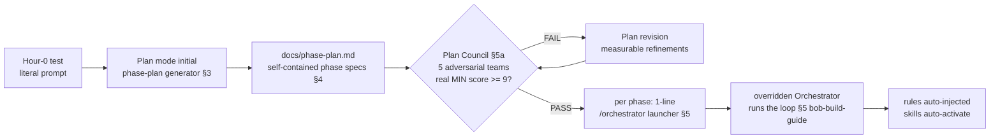

# OSS Preflight — Supercharged IBM Bob Prompts & Pro Tips

> **Reference for [bob-build-guide.md](./bob-build-guide.md).** In the new model you hand-type **four things only**: (1) the Hour-0 test, (2) the Plan-mode phase-plan generator, (3) a one-line Orchestrator launcher per phase, (4) the runtime skill demo. Everything else — discipline, the loop, skill activation — is encoded in `.bob/` and fires automatically.

---

## 1. The operating model — read this first (no ambiguity)



**Who does what (single responsibility, zero overlap):**

| Layer | Owns | Does NOT |
|---|---|---|
| [implementation-plan.md](./implementation-plan.md) | human strategy: P0–P7, scope cutline, gates, risks | contain executable specs |
| **Plan mode** (§3 initial generator + scoped revisions) | *generate/refine* `docs/phase-plan.md` — one Orchestrator-ready spec per P-phase | write code, run the loop |
| `docs/phase-plan.md` (generated) | the executable contract per phase (§4 schema) | be hand-edited during build |
| **Plan Council** (§5a, gate) | adversarially judge the plan to ≥9/10 before any build | edit the plan or code (it judges; `plan` revises) |
| **Orchestrator** (per phase, §5) | read one phase spec + run the encoded loop; author its own `new_task` messages | read this file; commit without the human gate |
| `.bob/rules/` | the always-on floor (auto-injected every mode) | be restated in prompts |
| skills | the recipes (guaranteed in Advanced; `reviewer` declares the official `skill` group) | replace always-on rules or become the only source of discipline |

**Answering "are these prompts auto-injected?" — no.** The Orchestrator does not read `bob-prompts.md`. It synthesizes each subtask's instructions from its encoded loop (`.bob/custom_modes.yaml`) **plus the phase spec** you point it at. Bob auto-injects **rules**; Bob auto-activates **skills** by `description`. So the operational input per phase is the *generated phase spec*, and this file is now: **the generator (§3) + the phase-spec contract (§4) + the launcher (§5) + the two non-loop prompts (§6) + tips/anti-patterns wired to their enforcement (§7–8).** The old per-session build prompts are **promoted** into the §4 contract — nothing lost, everything sharpened.

---

## 2. The supercharge levers (applied everywhere below)

Every prompt/spec here applies the official best-practice levers (https://bob.ibm.com/docs/ide/getting-started/best-practices), and each is now **enforced by a mechanism**, not advice:

| Lever | Enforced by |
|---|---|
| Specific over vague | §4 phase-spec contract — a phase is invalid if a field is missing |
| Context mentions, not paste (`@/file`) | generator forbids paste; phase spec lists exact `@/` inputs |
| Output format named | each spec states its artifact + shape + Definition of Done |
| Constraints up front | `.bob/rules/` always-on floor + per-phase quality gates |
| Plan before code | Plan mode (markdown-only) generates the plan; user-approved before any `code` |
| One task, one objective | one spec = one objective; Orchestrator delegates one slice per `new_task` |

> Discipline is **always-on** via `.bob/rules/` (evidence, engineering standards, security, scope, claims). You never restate it. Optional reinforcement for a high-stakes phase only: *"Reinforce @/.bob/rules/ — invariants are non-negotiable."*

---

## 3. THE prompt that matters — Plan-mode phase-plan generator

Run initially in `plan` mode (markdown-only by construction). This single supercharged prompt converts strategy into an Orchestrator-ready execution contract; later Plan Council failures may trigger scoped Plan-mode revisions to the generated file.

```text
/plan
Generate docs/phase-plan.md: an ordered, self-contained execution contract,
one spec per P-phase in @/docs/implementation-plan.md §4–§5.

Sources (read, do not paste): @/docs/architecture.md (contracts, scoring,
data model, API), @/docs/implementation-plan.md (phases, scope cutline §2,
gates, risks §9), @/docs/bob-build-guide.md §5 (the loop), @/.bob/custom_modes.yaml
(fences), @/.bob/rules/ (the always-on floor), @/.bob/skills/ (recipes).

For EVERY P-phase emit a spec that EXACTLY matches the §4 contract of
@/docs/bob-prompts.md — every field present, nothing implied. Each spec MUST
be self-contained: an Orchestrator subtask must be runnable from the spec
alone, needing no other context. Resolve all ambiguity now by asking me
clarifying questions before writing — a shipped spec has zero open questions.

Hard requirements:
- Acceptance criteria are binary and testable (a machine or a reviewer can
  say pass/fail with no judgement call).
- Every phase states its correlation + measure of success against the overall
  project goal, and its integration-success contract with adjacent phases.
- Quality gates name WHICH rule/skill enforces each gate.
- Test scenarios enumerate explicit cases incl. the must-test list.
- Loop config names the delegated mode + skills per step, the measurable
  progress rule for continued loops, the stalled-progress escalation rule, and
  the non-skippable human-review-before-commit gate.
- Respect every fileRegex fence; never plan a write outside a mode's fence.
- Keep scope inside the must-ship cutline; mark should/cut explicitly.

Output markdown only. End by asking me to approve docs/phase-plan.md before
any phase is launched.
```

**Done:** `docs/phase-plan.md` exists; every P-phase is a §4-conformant, self-contained, zero-open-questions spec; you approved it. (Plan-mode markdown-only edit is expected — https://bob.ibm.com/docs/ide/features/modes.)

---

## 4. The phase-spec contract (what the planner MUST emit per phase)

This **replaces the old hand-run S03–S08 prompts**. Every phase in `docs/phase-plan.md` must contain all of the following — a phase missing any field is invalid and the Orchestrator must refuse it and escalate.

> The `S<id>` in the header is **not** free choice — take it from the
> authoritative Phase → Session map in [bob-build-guide.md](./bob-build-guide.md)
> §7 (note P3+P4 → the single session S05).

```markdown
### Phase <Pn> — <title>   (maps to session S<id> per bob-build-guide §7 map)

**Objective** — one sentence, an outcome (not a task list).

**Correlation & success measure** — how this phase advances the overall
project goal in @/docs/architecture.md §17; the measurable signal that proves
it (e.g. "discord.js ranks #1 on the demo fixture, byte-stable").

**Self-contained context** — the exact inputs an Orchestrator subtask needs,
as @/ mentions only (files, contracts, sections). No external knowledge
assumed. No pasting.

**Scope** — in: …  ·  out (cutline): …  ·  should/cut: …

**Preconditions** — which prior phase outputs must exist + be green.

**Acceptance criteria** — numbered, binary, testable. Each maps to a test
scenario below.

**Quality gates** — each gate names its enforcer:
- evidence discipline → `.bob/rules/01` + `evidence-discipline` skill
- engineering standards/security → `.bob/rules/02`
- scope/gates → `.bob/rules/03`
- claims → `.bob/rules/04`
- review depth → `code-review` skill (reviewer)
- test/determinism → `test-runner` skill (advanced)

**Test scenarios** — explicit cases incl. the must-test list (determinism,
missing-evidence, cache-fallback, normalization, smoke, fact/inference).

**Integration success** — how it composes with adjacent phases; the
one-pipeline contract (web/skill call the CLI, never import core).

**Loop config** — steps to run; per-step delegate+skills (spec→plan;
implement→code; review→reviewer[code-review,evidence-discipline];
test→advanced[test-runner,evidence-discipline]; fix→code; enhance→code,
docs→advanced[doc-writer]; commit→code); value-gated loop continuation
rule; stalled-progress escalation rule; human gate before commit.

**Evidence artifact** — official `bob_sessions/S<id>-<slug>/` folder
containing the task-history markdown and task-session consumption-summary
screenshot + the `bob_sessions/build-report.md` row this phase must leave.

**Definition of Done** — all acceptance criteria green; quality gates passed;
evidence exported; human approved; committed with a Bob-generated message.
```

> The planner fills this from `implementation-plan.md` (P0–P7) + `architecture.md` (contracts). It is the *single* place build detail lives at runtime — no third taxonomy, no mixed responsibilities. The assembled plan is not build-ready until it clears the **Plan Council** (§5a) at ≥9/10.

---

## 5a. The plan-council gate — iterate after §3 until real PASS

A hard quality gate: 5 independent adversarial teams judge `docs/phase-plan.md`
for idempotent build-readiness. **No phase launches until it PASSes** (enforced
by `.bob/rules-orchestrator/`). One line:

```text
/orchestrator Convene the plan-council on @/docs/phase-plan.md. Run all 5
adversarial teams as independent subtasks (reproducibility/idempotency,
architecture fidelity, AC/test rigor, integration/data-contract continuity,
gap/risk red team). Gate = MIN team score >= 9 AND zero blockers. Scores must
reflect real measurable build-readiness, not inflated confidence. On FAIL,
consolidate findings, delegate a scoped Plan-mode revision that records
measurable refinements, then re-run all 5 teams. Continue while each round
resolves blockers, strengthens acceptance criteria, repairs contract drift, or
improves reproducibility. Stop and escalate only if progress stalls for two
cycles, an external decision is required, or I ask you to stop. Record every
Council Verdict at the top of docs/phase-plan.md.
```

**Done:** `docs/phase-plan.md` carries `## Council Verdict (round N) = PASS`, every team ≥9, zero blockers, plus measurable refinements for any failed rounds. Protocol: `.bob/skills/plan-council/SKILL.md`. The council **judges only** — `plan` does any revision.

> BobCoin cost is no longer the limiting factor. The limiting factor is measurable value: a new round is justified only when the prior round produced concrete plan improvements. The gate exists to turn "a plan" into "a gapless, reproducible plan any agent can build."

## 5. The per-phase launcher — what you actually type

Once `docs/phase-plan.md` is approved **and the council PASSes**, each phase is **one line**:

```text
/orchestrator Run Phase <Pn> from @/docs/phase-plan.md. Honor every field as
the contract. Loop until all acceptance criteria are met while each loop
produces measurable progress; escalate the precise gap only if progress stalls
or an external decision is required. Export the Bob task-history markdown and
consumption-summary screenshot into bob_sessions/S<id>-<slug>/, then STOP for
my review before commit.
```

Resume / escalation variants:

```text
/orchestrator Phase <Pn> failed acceptance criterion <#>. Resume the loop at
REVIEW with that as the only open item; do not re-open passed criteria.
```
```text
/orchestrator Phase <Pn> has stalled with no measurable progress. Summarize
the exact unmet criterion and the blocking cause. Do not commit. Wait for my
decision.
```

> Skills are normally not named by you — they fire by `description` match. Advanced is the guaranteed skill runtime; `reviewer` also declares the official `skill` group so review recipes can fire where the installed Bob build supports it. On all custom-mode steps the always-on rules remain the floor.

---

## 6. Standalone literal prompts (not loop phases)

Two tasks are not feature loops — run them as literal prompts.

### S00 — Hour-0 export test · mode: Ask or Code

```text
Summarize this repo in five bullets and create docs/hour0-bob-export-test.md
(≤10 lines). Touch no other file.
```

**Done:** note exists; you exported this session from Bob IDE History, saved both the task-history markdown and task-session consumption-summary screenshot to `bob_sessions/S00-hour0-export-test/`, and recorded the exact export format (UI path, file type, includes tool calls/diffs?) in @/bob_sessions/build-report.md → Export Notes. This proves the export pipeline *before* the build depends on it.

### S07 — Runtime skill demo · mode: Advanced (guaranteed skill runtime) · skill: oss-preflight-advisor

```text
Activate the OSS Preflight Advisor workflow. Read repo context (package manager,
language, framework, README, license, test command), state the exact
`oss-preflight recommend` sequence, present the top recommendation with its
Evidence Passport summary + missing-evidence notes, ask before scaffolding.
Write nothing outside .oss-preflight/, docs/oss-preflight/, examples/, oss-preflight-output/.
```

**Done:** skill activates **in Advanced** (guaranteed by https://bob.ibm.com/docs/ide/features/skills), presents recs or the exact CLI sequence, stays in approved paths. This is the "OSS Preflight ships *as* a Bob skill" proof.

---

## 7. Pro tips — now wired to their enforcement (not advisory)

Each lever is active because something enforces it. Column 3 is where it lives.

| # | Pro tip | Enforced at | Source |
|---|---|---|---|
| 1 | Plan edits markdown only — generate the plan there, hand to `code` | overridden `plan` fence | modes |
| 2 | Skills are guaranteed in Advanced; custom modes may declare official `skill` where supported | loop §5 routes guaranteed recipe steps to Advanced and gives `reviewer` the official `skill` group | skills · custom-modes |
| 2b | Rule = floor, skill = recipe, mode = who/where | `.bob/rules/` vs `.bob/skills/` split | skills |
| 3 | The skill `description` *is* the activation trigger | each `SKILL.md` description written as user phrases | skills |
| 4 | "Restore Files & Task" beats re-prompting bad output | checkpoint recovery, not corrective prompts | best-practices |
| 5 | Checkpoints don't snapshot before commands | guard risky commands manually | checkpoints |
| 6 | `whenToUse` drives Orchestrator routing | `custom_modes.yaml` `whenToUse` per mode | custom-modes |
| 7 | `rules-{slug}/` dir beats single file; alpha-loaded | `01-` prefixed mode-rule files | custom-modes |
| 8 | Project rules auto-inject every conversation, all modes | `.bob/rules/` is the reliability backbone | rules |
| 9 | `fileRegex` fences are demo evidence, not just safety | every mode has a fence; show on stage | custom-modes |
| 10 | Context mentions over pasting (`@/file`, ⌘+L) | §3 generator + §4 spec forbid paste | best-practices |
| 11 | New task per objective | one phase = one `/orchestrator` launch | best-practices |
| 12 | `.bobignore` protects generated/known-good files | add `examples/`, caches, secret-adjacent paths | best-practices |
| 13 | Enhance Prompt before expensive sessions | run §3 generator + launchers through Enhance | best-practices |
| 14 | Conventional-commit regeneration is free iteration | sparkle icon; `feat/<phase>` branch names | commit-messages |
| 15 | Export per session, never once at the end | phase-spec **Evidence artifact** field | hackathon |
| 15b | Export directly into official `bob_sessions/` folder with task-history markdown + consumption screenshot | bob-build-guide §8 + final checklist | hackathon guide pp. 18–19 |
| 15c | Treat BobCoins as free but value-gated; one objective per task, no speculative loops | S00–S08 session map + measurable-progress gates | IBM clarification + hackathon guide |
| 16 | Override the slug, don't add a parallel one | `plan`/`code`/`orchestrator` overridden | custom-modes |
| 17 | Encode the human gate into the Orchestrator | `custom_modes.yaml` orchestrator STEP 9 | modes |
| 18 | Keep looping while there is measurable progress; escalate stalled gaps | orchestrator STEP 7 value gate | modes |

Sources: modes/custom-modes/skills/rules/checkpoints/commit-messages/best-practices/hackathon — full URLs in §9.

---

## 8. Anti-patterns — now guarded (each has a mechanism that blocks it)

| Anti-pattern | What blocks it |
|---|---|
| Pasting whole files | §3 generator + §4 spec mandate `@/` mentions only |
| Re-prompting bad output instead of restoring | pro tip 4; checkpoint discipline |
| Expecting skills in `code`/`plan` | `code`/`plan` do not declare `skill`; loop §5 routes recipe steps to `reviewer` where supported or Advanced as the guaranteed runtime |
| One mega-task for the whole build | one phase = one launch; per-phase exports |
| Writing app code in `plan`/`reviewer` | `fileRegex` fence blocks it — by design |
| Adding a parallel custom slug | `plan`/`code`/`orchestrator` are overridden, not duplicated |
| Orchestrator committing without human review | encoded STEP 9 — non-skippable; do not prompt around it |
| Hand-editing a phase mid-build | phase-plan.md is the approved contract; change = re-spec in `plan` |
| Mixed responsibilities (plan doing code, etc.) | §1 single-responsibility table + fences |
| Exporting only at the end | phase-spec **Evidence artifact** field per phase |
| Creating a parallel export ledger | official `bob_sessions/` folder is the single export location; `bob_sessions/build-report.md` is the summary |
| "guaranteed/perfect/proves best" copy | `.bob/rules/04-presentation-claims.md` |

---

## 9. Source index

- Modes — https://bob.ibm.com/docs/ide/features/modes
- Custom modes — https://bob.ibm.com/docs/ide/configuration/custom-modes
- Skills — https://bob.ibm.com/docs/ide/features/skills
- Rules — https://bob.ibm.com/docs/ide/getting-started/tutorials/standardize-bobs-behavior
- Checkpoints — https://bob.ibm.com/docs/ide/features/checkpoints
- Commit messages — https://bob.ibm.com/docs/ide/features/commit-messages
- Best practices — https://bob.ibm.com/docs/ide/getting-started/best-practices
- Hackathon — https://lablab.ai/ai-hackathons/ibm-bob-hackathon
